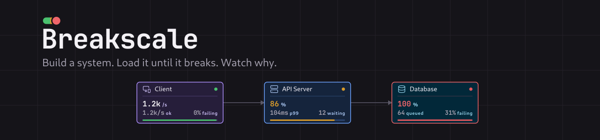
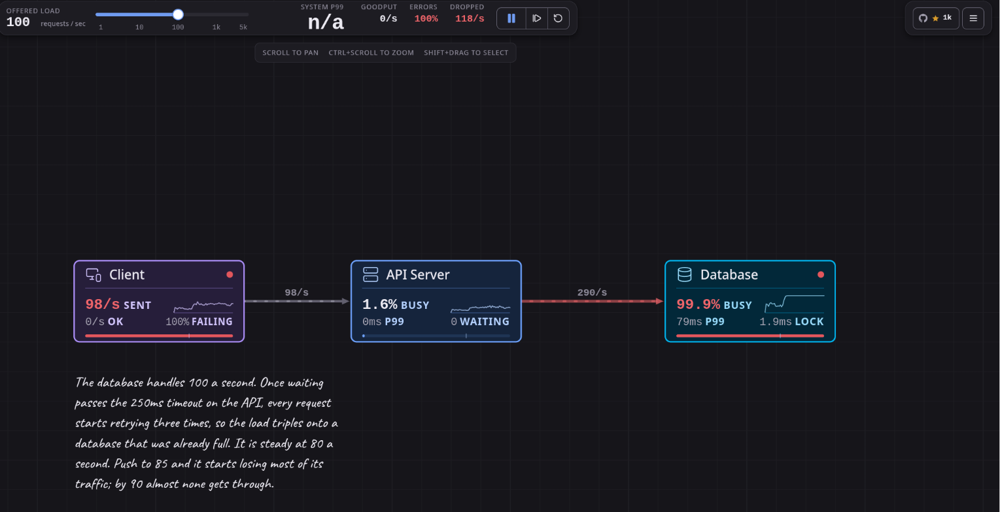

<p align="center">
  
</p>

<h4 align="center">
  <a href="https://breakscale.tech">Open Breakscale</a> |
  <a href="https://docs.breakscale.tech">Documentation</a> |
  <a href="https://marketplace.visualstudio.com/items?itemName=xevrion.breakscale">VS Code</a> |
  <a href="mcp/README.md">MCP server</a> |
  <a href="CONTRIBUTING.md">Contributing</a>
</h4>

<div align="center">
  <h3>
    A system design simulator where every number is measured.<br />
    Build a system, load it until it breaks, and watch why.
  </h3>
</div>

<p align="center">
  <a href="https://github.com/xevrion/breakscale/actions/workflows/ci.yml"></a>
  <a href="https://www.npmjs.com/package/breakscale-mcp"></a>
  <a href="https://marketplace.visualstudio.com/items?itemName=xevrion.breakscale"></a>
  <a href="https://github.com/xevrion/breakscale/stargazers"></a>
  <a href="LICENSE"></a>
  <a href="CONTRIBUTING.md"></a>
</p>

<p align="center">
  <a href="https://trendshift.io/repositories/194049" target="_blank" rel="noopener noreferrer"></a>
</p>

<p align="center">
  <sub>Title sponsor</sub><br>
  <a href="https://workers.io">
    <picture>
      <source media="(prefers-color-scheme: dark)" srcset="docs/sponsors/workersio-dark.svg">
      
    </picture>
  </a><br>
  <sub><a href="https://workers.io">Workers IO</a> (YC F26) sponsors Breakscale. Simulation environments for verifying mission-critical software.</sub>
</p>

<div align="center">
  
  <p align="center">
    <sub>The Retry Storm example at 100 requests a second. The database is 99.9% busy and goodput
    is zero, because retries have turned 100 offered requests into 348 hitting a database that was
    already full.</sub>
  </p>
</div>

Breakscale lets you put load balancers, caches, databases, queues and 29 other components on a
canvas, wire them into a system, and drag the traffic up until something gives. What you see
while it happens is a real discrete-event simulation: latency percentiles climbing, queues
filling, circuit breakers tripping, and whole systems collapsing into retry storms, all measured
from individual simulated requests rather than drawn to look plausible.

It runs in your browser, inside VS Code, and inside your AI assistant, which can read your code,
draw your architecture, and tell you where it breaks.

## Why it exists

Most system design material is static diagrams and rules of thumb. "Add a cache." "Use a queue."
That makes it hard to build any intuition for why p99 latency falls off a cliff once utilisation
passes 80 percent, or how a short timeout with a couple of retries turns one slow database into a
total outage.

Breakscale runs the experiment instead of describing it. Load the Retry Storm example, drag the
traffic up, and watch goodput fall to zero while the database is still working flat out, because
every request it finishes has already been abandoned by a caller that gave up waiting.

## Three ways to use it

### In your browser

Open [breakscale.tech](https://breakscale.tech), pick an example from the left, and raise the
traffic slider until something turns red. There is no account to make. A design stays in your
browser unless you share it, and a shared design is encrypted before it leaves, with the key kept
in the part of the link that browsers never send to a server.

### In VS Code

Install [Breakscale from the Marketplace](https://marketplace.visualstudio.com/items?itemName=xevrion.breakscale)
and run **Open Breakscale** from the command palette. The whole simulator opens in a panel beside
your code, with the same engine and examples as the website, and it works offline. Designs you
save there live in VS Code's own storage; a share link or a `.breakscale` file moves one between
the editor and the website.

### With your AI assistant

Breakscale is also an [MCP server](mcp/README.md), so Claude Code, Copilot, Cursor, Codex and
other assistants can use it for you. Point one at a repo and ask it to turn the architecture into
a design, or just describe a system, and it builds the design, runs it through the same engine, and
comes back with measured numbers and a breakscale.tech link that opens it.

```bash
# Claude Code
claude mcp add --scope user breakscale -- npx -y breakscale-mcp --stdio

# VS Code
code --add-mcp '{"name":"breakscale","type":"stdio","command":"npx","args":["-y","breakscale-mcp","--stdio"]}'
```

Any other assistant runs the same `npx -y breakscale-mcp --stdio`, and all it needs is Node 20.
In assistants that support [MCP Apps](https://modelcontextprotocol.io/docs/extensions/apps), such
as VS Code and Cursor, the design also opens as a live canvas right in the chat, and anything you
change there goes back to the assistant, so its next edit starts from what you are looking at. The
[MCP guide](mcp/README.md) has setup for every client and some prompts worth trying.

A few things to ask once it is connected:

- "Read this repo and turn its architecture into a Breakscale design. Tell me which numbers you guessed."
- "Design a URL shortener that handles 2,000 requests a second, and show me where it breaks."
- "Double the traffic. What fails first, and how would you fix it without adding servers?"

## Features

- **33 components.** Load balancers, caches, databases, queues and workers, plus CDNs, rate
  limiters, circuit breakers, read replicas, shards, autoscalers, stream brokers, WebSocket
  gateways, serverless functions, bulkheads and more.
- **23 worked examples.** Sixteen teaching scenarios that each isolate one failure mode, and seven
  reconstructions of real architectures.
- **A real discrete-event engine.** Finite server slots, gamma-distributed service times and
  measured percentiles, with no formula standing in for the simulation.
- **Chaos controls.** Crash a node, slow it down, force an error rate, or cut a single link, then
  watch the failure travel.
- **Deterministic runs.** The same seed and topology replay identically, every time.
- **Explanations built in.** Every metric and unit has a plain-language definition one hover away.
- **Share links and design files.** Send a design as an encrypted link, or save it as a
  `.breakscale` file that opens on the website and in VS Code.
- **Private by design.** No account, and your designs never leave your machine unless you share
  them. The website counts page views with Vercel's cookie-free analytics; the extension and the
  MCP server have no analytics at all.

## Examples

| Example             | What it teaches                                                  |
| ------------------- | ---------------------------------------------------------------- |
| Single Server       | Latency climbs sharply as the database fills up                  |
| Load Balanced       | Three servers share the load, but all still talk to one database |
| Cache Aside         | Lower the hit rate and the database takes the whole load         |
| Async Workers       | The backlog grows when workers fall behind, and drains after     |
| Retry Storm         | Retries multiply the load that caused them                       |
| Rate Limited API    | Serves slightly less, but what it serves stays fast              |
| Circuit Breaker     | Break the dependency, watch the circuit trip, then recover       |
| Sharded Database    | One shard melts while the average still looks healthy            |
| Autoscaling Service | Requests fail in the gap while new servers boot                  |

Plus **Netflix**, **Spotify**, **Discord**, **Uber**, **Twitter/X**, **Stripe** and **WhatsApp**,
reconstructed from published engineering material. Each one says what it models and what it
leaves out: they are teaching diagrams, not insider knowledge.

## How the simulation works

The engine in `src/sim` is a discrete-event simulator. Requests are real objects moving through
the topology, and a handful of details are what make its results worth trusting.

**Finite server slots.** A component's `capacity` is how many requests it can work on at once, and
`instances` is how many copies of it are running. Anything beyond `instances × capacity` waits in a
real FIFO queue, and anything beyond the queue limit is shed.

**Service time variance.** Service time is a mean plus a coefficient of variation, sampled from a
gamma distribution. Variance is what pulls tail latency away from the average, so it is modelled
rather than assumed away.

**Abandoned work still burns capacity.** When a caller times out, the downstream keeps working on a
request nobody is waiting for any more. That is why retry storms are something you can watch here
rather than something you read about.

**Queues acknowledge immediately.** A request entering a queue resolves as a success at that point,
and the message is buffered for workers, so backlog depth is real and you can watch it build and
drain.

**Percentiles are measured.** p50, p95 and p99 come from a ring buffer of completed request
latencies, never from multiplying a mean by a constant.

Runs are deterministic: the same seed and topology replay identically. The test suite checks that
requests are conserved, that the failure breakdown sums to the failure total, that utilisation
stays in bounds, and that no snapshot field is ever `NaN` or infinite.

## Run it locally

You need [Bun](https://bun.sh).

```bash
git clone https://github.com/xevrion/breakscale.git
cd breakscale
bun install
bun dev
```

Then open http://localhost:5173.

```
src/sim/         the simulation engine. No React, no DOM, no I/O
src/components/  canvas, inspector, metrics, palette
src/content/     glossary text
src/App.tsx      shell: layout, the animation loop, persistence
extension/       the VS Code extension
mcp/             the MCP server
worker/          the Cloudflare Worker behind short share links
```

The engine has no UI dependency, so you can drive it from a script:

```ts
import { Engine } from './src/sim/engine';
import { PRESETS } from './src/sim/presets';

const engine = new Engine(PRESETS[0].topology, 42);
for (let i = 0; i < 600; i += 1) engine.advance(1000 / 60);
console.log(engine.snapshot().system);
```

## Contributing

- Found a bug, or a number that looks wrong? [Open an issue](https://github.com/xevrion/breakscale/issues).
- Want to add a component, an example or a better explanation? Start with
  [CONTRIBUTING.md](CONTRIBUTING.md), which covers how the project fits together and the bar a
  change has to clear.

The short version of that bar is that the numbers have to be true. People learn from this tool, so
a plausible-looking number is worse than no number at all.

## Built with

React, TypeScript and Vite, with Lucide for icons. The canvas is hand-rolled SVG and the charts are
drawn directly rather than pulled from a charting library, which keeps the bundle small and the
rendering predictable.

## Thanks

Breakscale is supported by [Workers IO](https://workers.io), our title sponsor, and by these
companies, who provide their services to the project for free:

<p>
  <a href="https://vercel.com/oss"></a>
</p>

[Mintlify](https://mintlify.com) hosts the [documentation](https://docs.breakscale.tech).

## Star history

<a href="https://star-history.com/#xevrion/breakscale&Date">
  <picture>
    <source media="(prefers-color-scheme: dark)" srcset="https://api.star-history.com/svg?repos=xevrion/breakscale&type=Date&theme=dark" />
    <source media="(prefers-color-scheme: light)" srcset="https://api.star-history.com/svg?repos=xevrion/breakscale&type=Date" />
    
  </picture>
</a>

## License

[MIT](LICENSE)

The bundled Caveat webfont in `public/fonts/Caveat/` is **not** covered by the MIT licence. It is
licensed separately under the [SIL Open Font License 1.1](public/fonts/Caveat/OFL.txt), which ships
alongside the font file as that licence requires. Copyright 2014 The Caveat Project Authors.
